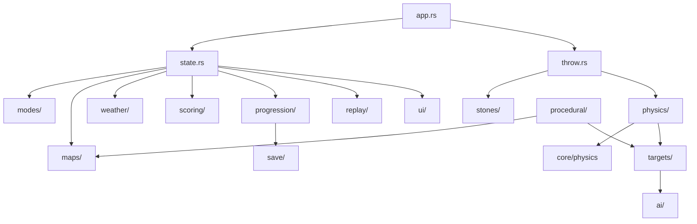

# Rock 3D — Arquitetura do Projeto

## Visão Geral

Rock 3D é implementado como módulo isolado em `src/games/rock_3d/`, consumindo a engine existente (`graphics`, `assets`, `audio`, `math`) e a nova camada `core/` (ECS, física).

```
desert-shooter-engine (crate)
├── engine/          # Loop winit genérico (futuro: GamePlugin)
├── graphics/        # Renderização multi-backend
├── assets/          # Meshes, texturas, terreno
├── audio/           # Engine de áudio base
├── math/            # glam + ray utilities
├── core/            # ECS, física, save, replay (compartilhado)
├── game/            # Desert Shooter (legado, intacto)
└── games/
    └── rock_3d/     # Rock 3D completo
```

---

## Camadas e Responsabilidades

### Layer 0 — Engine (`graphics`, `assets`, `audio`, `math`)

Infraestrutura sem regras de jogo. Expõe APIs de baixo nível.

### Layer 1 — Core (`core/`)

| Módulo | Responsabilidade |
|--------|------------------|
| `ecs/` | Entity, Component, World, Systems |
| `physics/` | RigidBody, colisões, constantes SI |
| `game_plugin.rs` | Trait `GamePlugin` para registro de jogos |
| `save/` | Serialização genérica (futuro) |
| `replay/` | Gravação/reprodução de frames (futuro) |

### Layer 2 — Game (`games/rock_3d/`)

| Módulo | Responsabilidade |
|--------|------------------|
| `app.rs` | Loop Rock3D (winit ApplicationHandler) |
| `state.rs` | Estado global da partida |
| `throw.rs` | Mecânica de mira e arremesso |
| `stones/` | Tipos de pedra, stats, desbloqueio |
| `targets/` | Alvos estáticos, móveis, chefes |
| `physics/` | Simulação de pedra em voo + colisões |
| `modes/` | Arcade, Precisão, Distância, Survival, Daily, MP |
| `progression/` | XP, níveis, skill tree, unlocks |
| `weather/` | Vento, chuva, neblina, temperatura |
| `scoring/` | Pontuação, combos, estrelas |
| `replay/` | Gravação de arremessos |
| `ai/` | FSM para alvos inteligentes |
| `procedural/` | Geração de layouts e desafio diário |
| `maps/` | Definições de ambientes |
| `ui/` | HUD Rock 3D |
| `audio/` | SFX específicos do jogo |
| `save/` | Persistência de progressão |

---

## ECS — Design

### Entities
```rust
type Entity = u32;
```

### Components (principais)
- `Transform` — pos, rot, scale
- `RigidBody` — mass, vel, angular_vel
- `Collider` — Sphere / Aabb
- `Stone` — tipo, spin, owner
- `Target` — kind, hp, points, weak_spots
- `Drawable` — mesh_id, material
- `AiAgent` — state, patrol_path
- `WeatherAffected` — modifier flags

### Systems (ordem de execução)
1. `input_system` — captura mira/arremesso
2. `throw_system` — spawna pedra se release
3. `weather_system` — atualiza vento/clima
4. `physics_system` — integra forças, colisões
5. `ai_system` — FSM dos NPCs
6. `scoring_system` — detecta hits, combos
7. `progression_system` — XP, unlocks
8. `replay_system` — grava frame
9. `sync_drawables_system` — ECS → GameWorld drawables
10. `render_system` — delega ao GfxRenderer

---

## Integração com Renderização

Rock 3D reutiliza:
- `GfxRenderer` para draw calls
- `Camera` para visão do jogador
- `AssetLibrary` + `GpuAssetCache` para meshes
- `ParticleSystem` para impactos
- `DayNightCycle` para iluminação
- `HudState` estendido via `RockHud` (dados enviados ao renderer)

O `Rock3DApp` em `app.rs` é um `ApplicationHandler` independente do Desert Shooter, compartilhando apenas infraestrutura.

---

## Fluxo de Dados

```
Input → ThrowController → EcsWorld (spawn Stone entity)
                              ↓
Weather → PhysicsWorld → Collision events → Scoring
                              ↓
                         ReplayRecorder
                              ↓
                    SyncDrawables → GfxRenderer
```

---

## Persistência

| Arquivo | Conteúdo |
|---------|----------|
| `saves/rock_3d/profile.json` | XP, nível, unlocks, skill points |
| `saves/rock_3d/daily.json` | Seed e score do desafio diário |
| `saves/rock_3d/replays/` | Arquivos de replay por arremesso |

---

## Networking (futuro)

Multiplayer local turn-based não requer rede. Para online:
- Host autoritativo via UDP (reutilizar `game/net.rs`)
- Sincronizar: seed do cenário, inputs de arremesso, resultado físico

---

## Dependências entre Módulos


