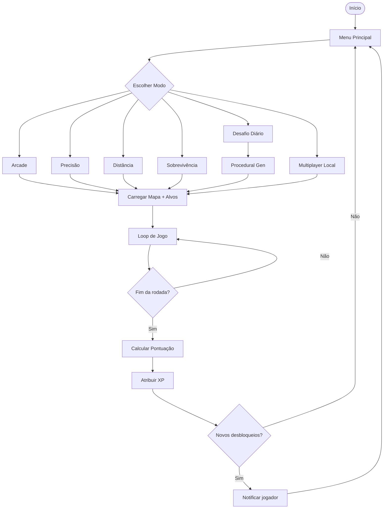
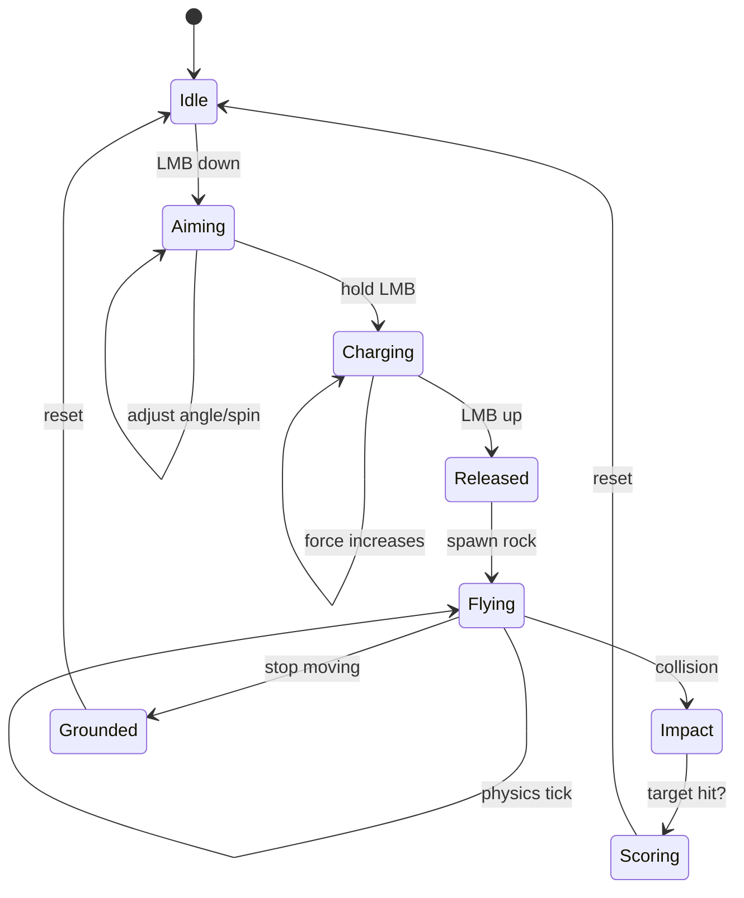
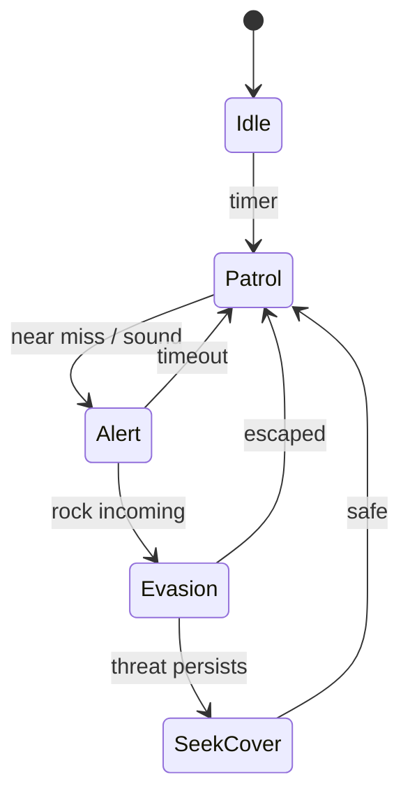
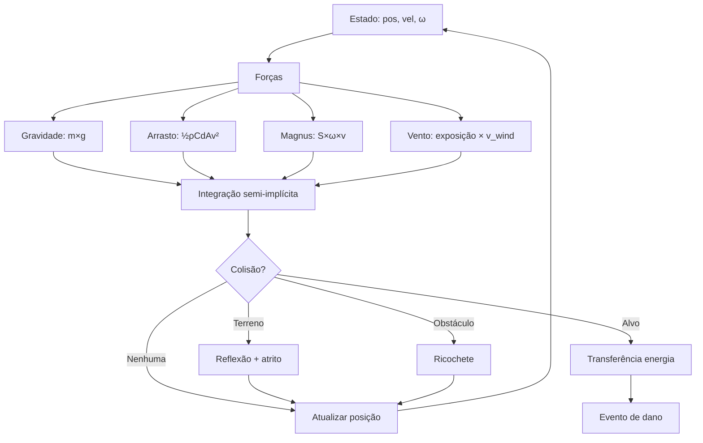
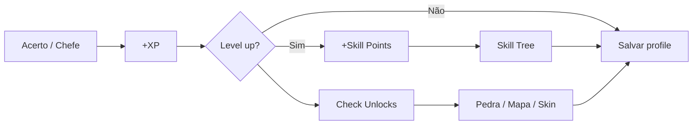

# Rock 3D — Fluxograma dos Sistemas

## Loop Principal do Jogo

## Loop de Frame (60 FPS)

```mermaid
flowchart LR
    subgraph Input
        I1[Mouse/Teclado]
        I2[Throw Charge]
    end

    subgraph Simulation
        S1[Weather Update]
        S2[Physics Integrate]
        S3[Collision Resolve]
        S4[AI Update]
        S5[Scoring Events]
    end

    subgraph Presentation
        P1[Sync Drawables]
        P2[Particles]
        P3[Render Scene]
        P4[Draw HUD]
        P5[Audio Triggers]
    end

    I1 --> I2
    I2 --> S1
    S1 --> S2
    S2 --> S3
    S3 --> S4
    S4 --> S5
    S5 --> P1
    P1 --> P2
    P2 --> P3
    P3 --> P4
    P4 --> P5
```

## Máquina de Estados — Arremesso

## Máquina de Estados — IA de Alvo

## Pipeline de Física da Pedra

## Fluxo de Progressão

